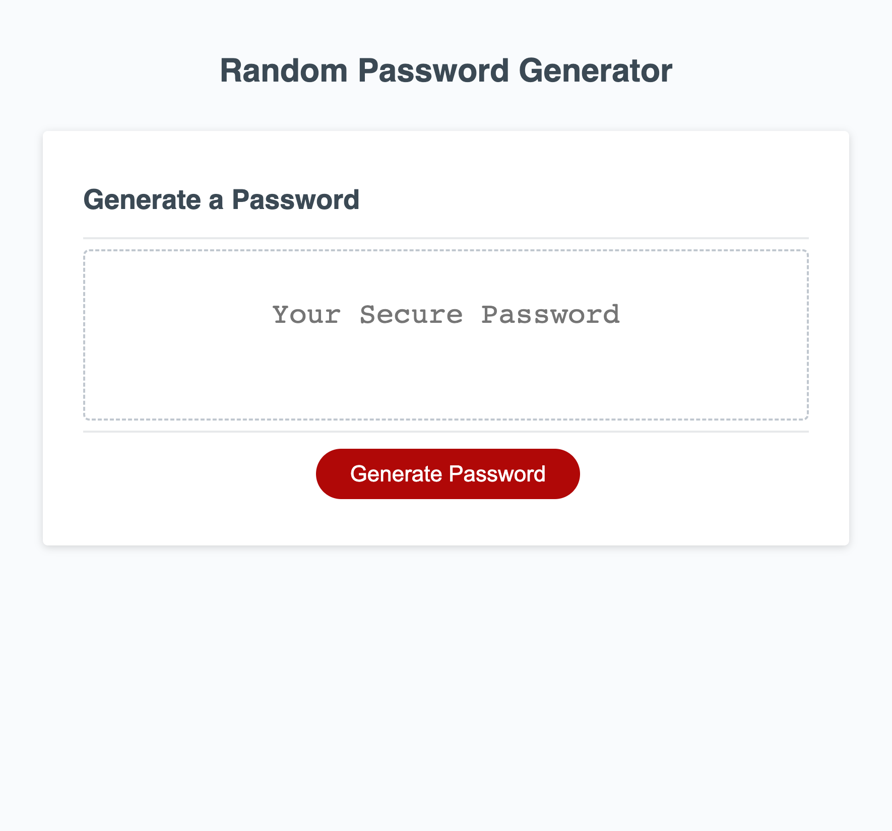

# Customizable-PW

Are you tired of trying to come up with distinctive passwords?
Can't remember which symbol or character could be used?
Build an application that makes a random password for you!

## Description

Write a program that you can use to come up with a random password depending on what you decide. Let's start with the starter code from Friendly-Parakeet.

## Source of starter code

Friendly-Parakeet: https://github.com/coding-boot-camp/friendly-parakeet

## Explanation

## Preview

## Link

To deploy: https://clkwong3.github.io/Customizable-PW/
